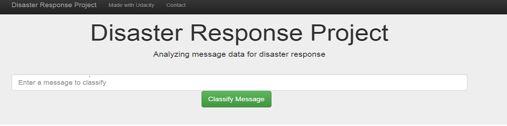
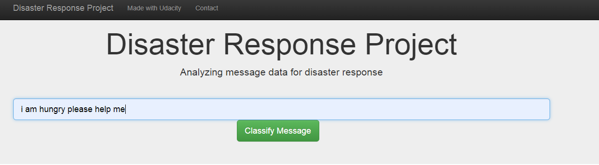
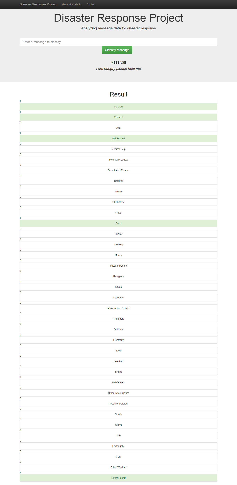
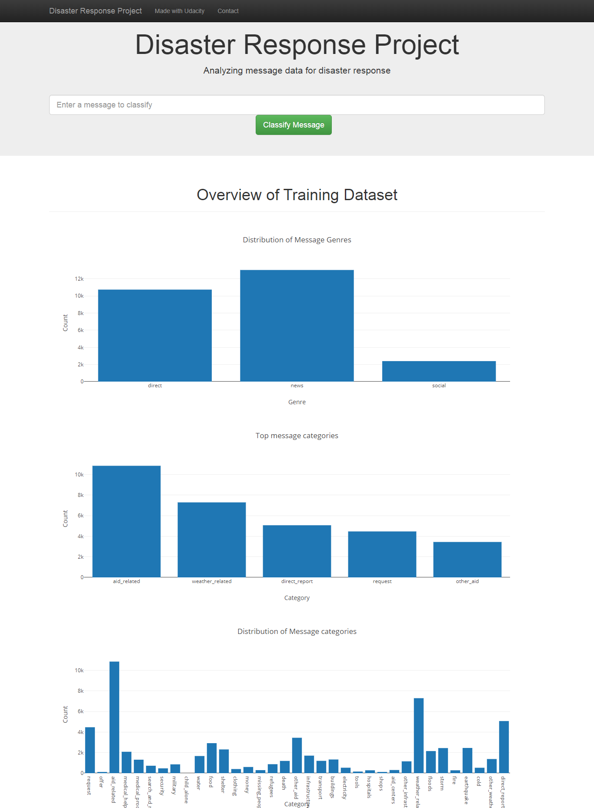

# Disaster_Response_Pipelines
Udacity Data Scientist Nano degree project(DSND)



## Table of Contents
1. [Description](#description)
2. [Getting Started](#getting_started)
	1. [Dependencies](#dependencies)
	2. [Installing](#installation)
	3. [Executing Program](#execution)
3. [Authors](#authors)
4. [License](#license)
5. [Acknowledgement](#acknowledgement)
6. [Screenshots](#screenshots)
7. [Future Enhancement](#future_enhancement )

<a name="descripton"></a>
## Description

This Project is part of Data Science Nanodegree Program by Udacity. The dataset contains pre-labelled tweet and messages from real-life disaster events. The project aim is to build a Machine learning model to categorize messages on a real time basis. 

This project is divided in the following key sections:

1. Processing data, building an ETL pipeline to extract data from source, clean the data and save them in a SQLite DB
2. Build a machine learning pipeline to train the which can classify text message in various categories
3. Run a web app which can show model results in real time

<a name="getting_started"></a>
## Getting Started

<a name="dependencies"></a>
### Dependencies
* Python 3.5+
* Machine Learning Libraries: NumPy, SciPy, Pandas, Sciki-Learn
* Natural Language Process Libraries: NLTK
* SQLlite Database Libraqries: SQLalchemy
* Model Loading and Saving Library: Pickle
* Web App and Data Visualization: Flask, Plotly

<a name="installation"></a>
### Installing
To clone the git repository:
```
git clone https://github.com/rojandhimal/Disaster_Response_Pipelines.git
```
<a name="execution"></a>
### Executing Program:
1. You should run the following commands in the project's directory to set up the database, train model and save the model.

    - To run ETL pipeline to clean data and store the processed data in the database
        `python data/process_data.py data/disaster_messages.csv data/disaster_categories.csv data/disaster_response_db.db`
    - To run the ML pipeline that loads data from DB, trains classifier and saves the classifier as a pickle file
        `python models/train_classifier.py data/disaster_response_db.db models/classifier.pkl`

2. Run the following command in the app's directory to run your web app.
    `python run.py`

3. Go to http://0.0.0.0:3001/

<a name="importantfiles"></a>
### Important Files
**app/templates/***: templates/html files for web app

**data/process_data.py**: Extract Train Load (ETL) pipeline used for data cleaning, feature extraction, and storing data in a SQLite database

**models/train_classifier.py**: A machine learning pipeline that loads data, trains a model, and saves the trained model as a .pkl file for later use

**run.py**: This file can be used to launch the Flask web app used to classify disaster messages

<a name="authors"></a>
## Authors

* [Rojan Dhimal](https://github.com/rojandhimal)

<a name="license"></a>
## License
[](https://opensource.org/licenses/MIT)

<a name="acknowledgement"></a>
## Acknowledgements

* [Udacity](https://www.udacity.com/) for providing an amazing Data Science Nanodegree Program


<a name="screenshots"></a>
## Screenshots

1. This is an example of a message we can type to test the performance of the model



2. After clicking **Classify Message**, we can see the categories which the message belongs to highlighted in green



3. The main page shows some graphs about training dataset, provided by Figure Eight



<a name="future_enhancement"></a>
## Future Enhancement 
From the message distribution chart we can see that the data are unbalanced. This data can be made balanced by applying databalancing technoque. This can give more accurate model.
Here we have used Randomforest Algorithm and there are many other algorithm that can give more accurate result. 